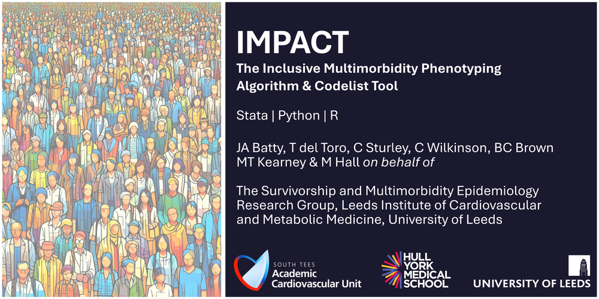
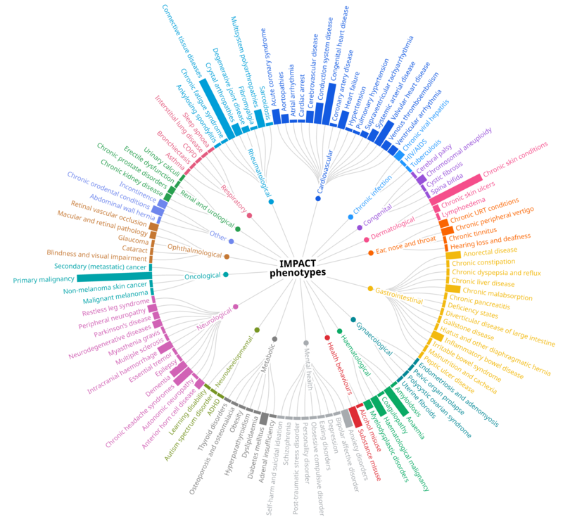

[](https://github.com/jonathanbatty/impact)
[](packages/stata/README.md)
[](packages/r/README.md)
[](packages/python/README.md)
[](https://github.com/jonathanbatty/impact/issues)
[](LICENSE)
[](https://github.com/jonathanbatty/impact/stargazers)

---

[Introduction](#introduction) | [Installation](#installation) ([Stata](#stata) | [R](#r) | [Python](#python) | [TREs](#TREs)) | [Syntax](#syntax) | [Feedback](#feedback) | [Acknowledgements](#acknowledgements) | [Citation](#suggested-citation)

---

## Introduction

IMPACT ascertains a wide range of long-term conditions from routinely collected, coded healthcare data. It maps each coded event to one of:

- 321 granular long-term conditions (LTCs); 
- 116 grouped phenotypes;
- 21 body system categories.



The output level must be selected on every run using `level = "ltc"` or
`level = "phenotype"` in R and Python, or `level(ltc)` or
`level(phenotype)` in Stata. Every input row produces one output row containing
the supplied identifier followed by binary `__<ID>` indicators for the chosen
output level.

Equivalent implementations are provided for Stata, R, and Python. All three
are installed directly from GitHub; IMPACT is not distributed through SSC,
CRAN, or PyPI.

The condition definitions can be updated by... buildfile


### Supported coding systems

| Value | Source coding system |
|---|---|
| `cprd_aurum_medcodeid` | CPRD Aurum medcodeid (`cprdaurum` and `medcodeid` are aliases) |
| `cprd_gold_medcode` | CPRD GOLD medcode (`cprdgold` is an alias) |
| `emis_local` | EMIS local codes |
| `icd10` | ICD-10 |
| `icd10cm` | ICD-10-CM |
| `icd10pcs` | ICD-10-PCS |
| `icd9cm` | ICD-9-CM |
| `icd9pcs` | ICD-9-PCS |
| `opcs4` | OPCS-4 |
| `read_cleansed` | Cleansed Read codes |
| `read_original` | Original Read codes |
| `snomed_concept` | SNOMED CT concept identifiers |
| `snomed_description` | SNOMED CT description identifiers |

Code columns should be stored as strings so that leading zeroes, decimal
points, and long identifiers are preserved. Surrounding whitespace is ignored.

### Codelists and generated definitions

[`codelist/master_codelist.csv`](codelist/master_codelist.csv) is the
authoritative master codelist. [`buildfile.py`](buildfile.py) generates the
Stata `__*.ado` definitions, compressed R internal data in `R/sysdata.rda`,
and the UTF-8 Python package resources from this master file. Generated
definitions should not be edited manually.

From the repository root, rebuild every package definition with:

```bash
python buildfile.py
```

Use `--rscript PATH` if `Rscript` is not on `PATH`. To rebuild only the R and
Python resources without regenerating the Stata definitions, run
`python buildfile.py --resources-only`.

## Installation

### Stata

See the [Stata package README](packages/stata/README.md) for complete usage
instructions.

```stata
net from https://raw.githubusercontent.com/jonathanbatty/impact/main/packages/stata/impact
net install impact, replace
help impact
```

### R

See the [R package README](packages/r/README.md) for complete usage
instructions.

```r
install.packages("remotes") # only needed if remotes is not installed
remotes::install_github("jonathanbatty/impact", subdir = "packages/r")
library(impact)
```

### Python

See the [Python package README](packages/python/README.md) for complete usage
instructions.

```bash
python -m pip install "git+https://github.com/jonathanbatty/impact.git#subdirectory=packages/python"
```

Pip is used only to install the GitHub source; IMPACT is not fetched from
PyPI.

### TREs
Trusted research environments (TREs) often restrict access to the open Internet, including GitHub. 

## Syntax

The common IMPACT interface requires an identifier, one or more coding
systems, the corresponding code columns, and the desired output level.

### Stata syntax

```stata
impact, dataset(string) id(varname) codesystems(string) ///
    searchvars(string) level(ltc|phenotype) ///
    [multimorbidity summary]
```

### R syntax

```r
impact(data, id, codesystems, searchvars, level,
       multimorbidity = FALSE, summary = FALSE)
```

### Python syntax

```python
impact(df, id, codesystems, searchvars, level,
       multimorbidity=False, summary=False)
```

| Argument | Meaning |
|---|---|
| `id` | Identifier column retained in the row-level output. |
| `codesystems` | One or more supported coding systems. |
| `searchvars` | Code-column group corresponding to each coding system. |
| `level` | Required output level: `ltc` or `phenotype`. |
| `multimorbidity` | Add phenotype-based multimorbidity measures. |
| `summary` | Print matched-code counts for each selected coding system. |

When `multimorbidity` is selected, IMPACT adds:

- `__nphenotypes`: number of the 116 grouped phenotypes present;
- `__nmental` and `__nphysical`: mental and physical phenotype counts;
- `__bs_<system>`: number of phenotypes present in each body system; and
- `__nbody`: number of body systems affected.

These measures always count grouped phenotypes, even when the requested output
level is `ltc`. Several granular LTCs belonging to one phenotype are therefore
counted once.

## Examples of key syntax

Full details and additional examples are available in the
[Stata](packages/stata/README.md), [R](packages/r/README.md), and
[Python](packages/python/README.md) package READMEs.

### Stata example

```stata
clear all
impact, dataset("events.dta") id(patid) codesystems(icd10) ///
    searchvars(icdcode) level(phenotype) multimorbidity summary
```

### R example

```r
out <- impact(events, id = "patid", codesystems = "icd10",
              searchvars = "icdcode", level = "phenotype",
              multimorbidity = TRUE, summary = TRUE)
```

### Python example

```python
from impact import impact

out = impact(events, id="patid", codesystems="icd10",
             searchvars="icdcode", level="phenotype",
             multimorbidity=True, summary=True)
```

Hard-coded functional examples and assertions are also provided in
[`packages/stata/stata_example.do`](packages/stata/stata_example.do),
[`packages/r/r_example.R`](packages/r/r_example.R), and
[`packages/python/python_example.py`](packages/python/python_example.py).

## Feedback

Please [open an issue](https://github.com/jonathanbatty/impact/issues) to
report suspected errors or omissions in the codelists, identify installation
or runtime problems, suggest feature enhancements, or make any other request.

## Acknowledgements

This work was done while JB was a member of the [Survivorship and Multimorbidity Epidemiology Group](https://multimorbidity-research-leeds.github.io/) at the University of Leeds, led by Dr Marlous Hall.

- JB received funding from a Wellcome Trust 4ward North Clinical Research Training Fellowship (227498/Z/23/Z; R127002).
- MH was funded by the Wellcome Trust Sir Henry Wellcome Postdoctoral Fellowship scheme (206470/Z/17/Z). 

## Suggested citation

Batty, J. A. (2026). *IMPACT: The Inclusive Multimorbidity Phenotyping Algorithm and Coding Tool* (Version 0.1.0) [Computer software].
https://github.com/jonathanbatty/impact
